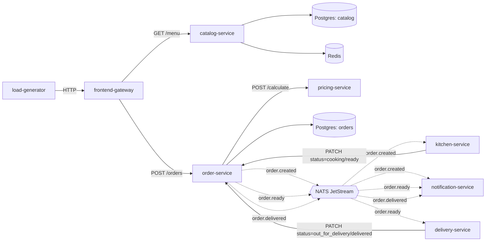

# Learn-OTel

A hands-on OpenTelemetry learning project, in two stages.

**Stage 1** (this repo, deployed): a small pizza-ordering microservice app — 7 Python
(FastAPI) services plus a load generator, Postgres, Redis, and NATS JetStream for async
messaging — running on Kubernetes via ArgoCD, with **zero observability**.

**Stage 2**: [`docs/observability-guide.md`](docs/observability-guide.md) — a step-by-step guide
to manually instrumenting every service with the OpenTelemetry SDK (traces, metrics, logs) and
standing up a SigNoz + OTel Collector pipeline to receive it.

## Architecture



Solid arrows are synchronous HTTP calls; dashed arrows are async NATS publish/consume.

## Layout

- `services/<name>/` — one FastAPI (or, for `load-generator`, a plain asyncio loop) service each,
  managed with `uv`.
- `libs/common/` — shared `app_common` package: settings base class, logging, HTTP client,
  NATS JetStream helpers, domain models. Depended on by every service via a uv workspace path
  dependency.
- `deploy/base/<name>/` — a Kustomize base per component (each service + Postgres/Redis/NATS).
- `deploy/overlays/home/` — the one overlay ArgoCD actually deploys (namespace `learn-otel`).
- `.github/workflows/build-and-push.yml` — builds/pushes changed services (multi-arch,
  `linux/arm64` + `linux/amd64`) to `ghcr.io/skarj/<service>` on push to `main`.

## Local dev

```
uv sync --all-packages
uv run --package order-service uvicorn order_service.main:app --reload
```

Each service's required env vars are declared as required fields on its `app/settings.py`
`Settings` class.
