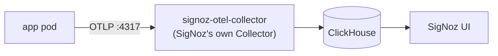

# Implementing OpenTelemetry Observability

This is the "before → after" exercise.

Stage 1 runs with **zero** observability — no OTel env vars, no SDKs, no exporters anywhere. This guide walks through instrumenting it end-to-end, manually (no `opentelemetry-instrument` auto-agent, no `opentelemetry-instrumentation-*` auto-instrumentor libraries) — you write every span, every metric, every context-propagation call yourself. That's slower than auto-instrumentation, but it's the point: auto-instrumentation is exactly this code, written for you, and it stops being magic once you've written it once by hand.

Work through the steps in order. Each has a checkpoint — don't move on until it passes.
---

## Step 1 — Deploy SigNoz:

1. Add `apps/signoz.yaml` to ArgoCD application repo. It uses official Signoz Helm chart.

The chart will install the next components:
- Signoz Statefullset
- Clickhouse Operator > Clickhouse Cluster Statefullset
- Zookeeper Statefullset
- OTel Collector

```yaml
# apps/signoz.yaml
apiVersion: argoproj.io/v1alpha1
kind: Application
metadata:
  name: signoz
  namespace: argocd
  finalizers:
    - resources-finalizer.argocd.argoproj.io
spec:
  project: default
  destination:
    server: https://kubernetes.default.svc
    namespace: observability
  source:
    repoURL: https://charts.signoz.io
    chart: signoz
    targetRevision: 0.141.1
    helm:
      valuesObject:
        clickhouse:
          replicaCount: 1
          zookeeper:
            replicaCount: 1
            resources:
              limits: {}
              requests:
                memory: 256Mi
                cpu: 100m
            persistence:
              storageClass: nfs-client
              size: 5Gi
          resources:
            requests:
              cpu: 500m
              memory: 1.5Gi
            limits:
              cpu: 1500m
              memory: 4Gi
          persistence:
            storageClass: nfs-client
            size: 5Gi
        signoz:
          replicaCount: 1
          resources:
            requests:
              cpu: 100m
              memory: 100Mi
            limits:
              cpu: 750m
              memory: 1000Mi
          persistence:
            storageClass: nfs-client
            size: 1Gi
        otelCollector:
          resources:
            requests:
              cpu: 100m
              memory: 200Mi
            limits:
              cpu: "1"
              memory: 2Gi
  syncPolicy:
    automated:
      prune: true
      selfHeal: true
    syncOptions:
      - CreateNamespace=true
```

2. We should expose the signoz UI using `HTTPRoute` at `signoz.cluster.home`
Note: As of today, Signoz official Helm Chart doesn't support `HTTPRoute`, so it should be added separately.

3. **Checkpoint**: `kubectl get pods -n observability` all Running, `https://signoz.cluster.home` loads the UI, no data yet (nothing's sending telemetry).

---

## Step 2 — Point apps at SigNoz's Collector

### Where's the Collector tier?

Skipped, deliberately. The standard production pattern is a **local Collector agent** (a DaemonSet, one pod per node) sitting in front of whatever Collector(s) come after it, so applications never need to know the address of anything downstream — they talk to whatever's running locally, which decouples every app from downstream specifics (which collector, how many hops, which address) and gives you a place to batch/sample/route before telemetry even leaves the node. That's genuinely good practice, and worth knowing about.

This is a small lab environment, not production, and the point right now is learning the OTel SDK, not operating a Collector fleet. An agent DaemonSet is one more pod per node, one more `ArgoCD Application`, one more thing to debug — for zero functional gain until you actually need sampling, routing, or multiple destinations. So for this project: every service exports **straight to SigNoz's own Collector**, `signoz-otel-collector.observability.svc.cluster.local:4317`.

To be precise about what that Collector actually is: `signoz-otel-collector` is *not* the backend — it's already a Collector instance itself, pre-configured by the SigNoz chart with exporters that know how to write into ClickHouse's schema. ClickHouse is the real backend (the thing that actually stores and gets queried).

If you later want to practice the local-agent pattern, it's a clean addition — swap one env var value for the Downward-API `HOST_IP` trick, deploy the DaemonSet, done.



### Wire it up

1. Add to each of the **8 application components** — `frontend-gateway`, `catalog-service`,
`order-service`, `pricing-service`, `kitchen-service`, `delivery-service`, `notification-service`,
`load-generator` — in `deploy/base/<service>/deployment.yaml`'s container `env:` block:

```yaml
- name: OTLP_ENDPOINT
  value: "http://signoz-otel-collector.observability.svc.cluster.local:4317"
```

No Downward API needed since there's no per-node component to find. **Not** Postgres, Redis, or NATS — those are off-the-shelf images with no OTel SDK and no code of ours running in them. Their side of every call still ends up traced, just from the *calling* service's manual CLIENT span (Step 3), not from anything configured on the database/cache/broker pods themselves.

2. Add `otlp_endpoint: str` to `BaseServiceSettings` in `libs/common/app_common/config.py`. This is what `settings.otlp_endpoint` in Step 3 below reads from.

3. **Verify before touching any app code**: fire one manual span at `signoz-otel-collector.observability.svc.cluster.local:4317` confirm it shows up in the SigNoz UI's trace explorer.

```bash
kubectl run otel-test --rm -it --restart=Never \
  --image=curlimages/curl:latest \
  --namespace=observability \
  -- sh -c '
    NOW=$(date +%s)
    curl -s -X POST "http://signoz-otel-collector.observability.svc.cluster.local:4318/v1/traces" \
      -H "Content-Type: application/json" \
      -d "{
        \"resourceSpans\": [{
          \"resource\": {\"attributes\": [{\"key\": \"service.name\", \"value\": {\"stringValue\": \"manual-test\"}}]},
          \"scopeSpans\": [{
            \"scope\": {\"name\": \"manual-test\"},
            \"spans\": [{
              \"traceId\": \"0123456789abcdef0123456789abcdef\",
              \"spanId\": \"0123456789abcdef\",
              \"name\": \"manual-test-span\",
              \"kind\": 1,
              \"startTimeUnixNano\": \"${NOW}000000000\",
              \"endTimeUnixNano\": \"${NOW}100000000\"
            }]
          }]
        }]
      }"
  '
```

**Checkpoint**: the manual test span is visible in SigNoz. Confirm `deploy/base/order-service/deployment.yaml` has `OTLP_ENDPOINT` wired before moving on to Step 3.

---

## Step 3 — Instrument `order-service` traces

1. Add the new dependencies this step needs to **`libs/common/pyproject.toml`**. Easiest way is to use via `uv add` from `libs/common/`

```bash
uv add opentelemetry-sdk opentelemetry-exporter-otlp-proto-grpc
```

It resolves a sensible version bound itself and updates `uv.lock` as part of adding it. That lock update isn't optional: every `Dockerfile` here runs `uv sync --frozen`, which refuses to deviate from `uv.lock` — add a dependency without regenerating it and the next `docker build` (or CI run) fails immediately with a lock-mismatch error. If you hand-edit `pyproject.toml` instead of using `uv add`, run `uv lock` from the repo root afterward.

2. Add a shared bootstrap to `libs/common/app_common/otel.py`. Every service calls this once, at startup, so it lives in `app_common`.

```python
from opentelemetry import trace
from opentelemetry.sdk.resources import Resource
from opentelemetry.sdk.trace import TracerProvider
from opentelemetry.sdk.trace.export import BatchSpanProcessor
from opentelemetry.exporter.otlp.proto.grpc.trace_exporter import OTLPSpanExporter


def configure_tracing(service_name: str, otlp_endpoint: str) -> None:
    resource = Resource.create({
        "service.name": service_name,
        "service.namespace": "learn-otel",
        "deployment.environment": "home",
    })
    provider = TracerProvider(resource=resource)
    provider.add_span_processor(BatchSpanProcessor(OTLPSpanExporter(endpoint=otlp_endpoint, insecure=True)))
    trace.set_tracer_provider(provider)
```

What each piece actually does:

- **`Resource`**: metadata about *what produced this telemetry* — not the span itself, the process emitting it. `service.name` here is exactly what makes SigNoz's Services list show `order-service`, `catalog-service`, etc. as distinct entries.
- **`TracerProvider`**: the per-process SDK object that actually holds this configuration (the resource, the exporters). Every span you create later comes from a `Tracer` obtained off this provider — it's the thing everything else attaches to.
- **`BatchSpanProcessor(OTLPSpanExporter(...))`**: what happens to a span once it finishes. `OTLPSpanExporter` serializes it and ships it over gRPC to `otlp_endpoint`. `BatchSpanProcessor` wraps that so spans get queued and sent in the background in batches, instead of blocking the request on a network call every single time a span ends — same batching concept as the Collector's own `batch` processor from Step 2, just at the SDK level instead of infra level.
- **`trace.set_tracer_provider(provider)`**: registers this as the *global* provider for the process. This is what makes `trace.get_tracer(__name__)` — called later, anywhere else in the code, with no explicit reference to `provider` — pick up this exact configuration automatically.


3. Call `configure_tracing(settings.service_name, settings.otlp_endpoint)` once at process startup (top of `app/main.py`, before the FastAPI app object is created), where `otlp_endpoint` is `signoz-otel-collector.observability.svc.cluster.local:4317` (see Step 2).

Since there's no framework auto-instrumentor, write a small ASGI middleware that manually starts a SERVER span per request, extracting whatever trace context arrived on the incoming headers:

```python
from starlette.middleware.base import BaseHTTPMiddleware
from opentelemetry import trace
from opentelemetry.propagate import extract
from opentelemetry.trace import SpanKind

class TracingMiddleware(BaseHTTPMiddleware):
    async def dispatch(self, request, call_next):
        ctx = extract(request.headers)
        tracer = trace.get_tracer(__name__)
        with tracer.start_as_current_span(
            f"{request.method} {request.url.path}", context=ctx, kind=SpanKind.SERVER
        ) as span:
            span.set_attribute("http.method", request.method)
            span.set_attribute("http.route", request.url.path)
            response = await call_next(request)
            span.set_attribute("http.status_code", response.status_code)
            return response
```

`app.add_middleware(TracingMiddleware)`. Writing this by hand is exactly what `FastAPIInstrumentor` does for you — now you know how.

Wrap the outbound call to `pricing-service` in a manual CLIENT span, injecting the current context onto the outgoing headers:

```python
from opentelemetry.propagate import inject

async def call_pricing_service(client, pricing_request):
    tracer = trace.get_tracer(__name__)
    with tracer.start_as_current_span("POST /calculate", kind=SpanKind.CLIENT) as span:
        span.set_attribute("http.method", "POST")
        span.set_attribute("peer.service", "pricing-service")
        headers = {}
        inject(headers)
        resp = await client.post("/calculate", json=pricing_request.model_dump(), headers=headers)
        span.set_attribute("http.status_code", resp.status_code)
        return resp
```

And wrap the Postgres query in a manual span with `db.*` attributes:

```python
with tracer.start_as_current_span("INSERT orders", kind=SpanKind.CLIENT) as span:
    span.set_attribute("db.system", "postgresql")
    span.set_attribute("db.name", "orders")
    span.set_attribute("db.statement", "INSERT INTO orders ...")
    # ... existing asyncpg call ...
```

**Checkpoint**: place an order, see a single `order-service` trace in SigNoz with the request span, the pricing-service CLIENT span (not yet connected to anything on the pricing-service side — that's Step 4), and the DB span nested underneath it.

---

## Step 4 — Instrument the rest of the sync chain

Repeat the exact same three ingredients — `configure_tracing()` at startup, the
`TracingMiddleware` for inbound spans, manual CLIENT spans with `inject()` for outbound calls —
in `pricing-service`, `catalog-service`, and `frontend-gateway`. `pricing-service` and
`catalog-service` only need the middleware (they don't call anything else synchronously except
Postgres/Redis, which get the same manual CLIENT-span treatment as `order-service`'s DB call).
`frontend-gateway` needs both the middleware and manual CLIENT spans for its calls to
`catalog-service` and `order-service`.

**Checkpoint**: one request through `frontend-gateway` produces a single trace with correctly
nested spans: `frontend-gateway` → `catalog-service` (menu lookup), `frontend-gateway` →
`order-service` → `pricing-service`, all as one waterfall in the SigNoz trace view. Trigger a
`pricing-service` artificial error or slowdown (it happens ~2-3%/~8% of requests on its own) and
confirm it's visible as a red span / a long span in the waterfall.

---

## Step 5 — Propagate trace context across the NATS hop

This is the one place nothing gives you propagation for free — NATS has no built-in tracing
convention, so this is entirely hand-rolled, and it's the most valuable lesson in this guide.

**On publish** (in `order-service`, when it publishes `order.created`, and in `order-service`'s
status-update handler when it publishes `order.ready`/`order.delivered`), inject the current
context into NATS message headers:

```python
from opentelemetry.propagate import inject
from opentelemetry.trace import SpanKind
import nats

async def publish_event_traced(js, subject, payload):
    tracer = trace.get_tracer(__name__)
    with tracer.start_as_current_span(f"{subject} publish", kind=SpanKind.PRODUCER) as span:
        span.set_attribute("messaging.system", "nats")
        span.set_attribute("messaging.destination", subject)
        headers = nats.aio.msg.Msg.Headers = {}
        inject(headers)
        await js.publish(subject, payload.model_dump_json().encode(), headers=headers)
```

**On consume** (`kitchen-service`, `delivery-service`, `notification-service`), extract the
context from `msg.headers` and decide how to relate the new span to the publisher's trace. Two
options, both valid, pick deliberately:

**Option A — new trace, linked to the parent (recommended, matches OTel messaging semantic
conventions for fan-out/fire-and-forget):**

```python
from opentelemetry.trace import Link

async def handle_order_created(msg):
    parent_ctx = extract(msg.headers or {})
    parent_span_ctx = trace.get_current_span(parent_ctx).get_span_context()
    tracer = trace.get_tracer(__name__)
    with tracer.start_as_current_span(
        "order.created process", links=[Link(parent_span_ctx)], kind=SpanKind.CONSUMER
    ) as span:
        ...
```
This produces a *separate* trace per consumer, each carrying a link back to the publish event —
correct because `order.created` genuinely fans out to two independent, unrelated pieces of work
(cooking, notifying) that don't causally block or belong to the original HTTP request's latency
budget.

**Option B — continue the same trace:**

```python
with tracer.start_as_current_span("order.created process", context=parent_ctx, kind=SpanKind.CONSUMER) as span:
    ...
```
Simpler, gives you one single waterfall from HTTP request all the way through cooking and
delivery — genuinely nice for a learning demo where you want to *see* the whole order lifecycle
in one view. Semantically it overstates the causal relationship (the HTTP response already
returned before cooking finishes), but for a learning exercise this trade-off is worth trying
both ways and comparing what each looks like in the SigNoz trace view.

**Checkpoint**: place an order, find the `order.created` publish span, and (depending on which
option you picked) either see linked-but-separate traces for kitchen/notification, or one
continuous trace spanning the whole order lifecycle. Try both — that comparison is the lesson.

---

## Step 6 — Repeat across the remaining services and hops

Apply Step 5's pattern to `delivery-service` (consuming `order.ready`, publishing nothing new
itself — it PATCHes `order-service`, which publishes `order.delivered`) and to
`notification-service`'s three consumers (`order.created`, `order.ready`, `order.delivered`).
By now this should be mechanical — same middleware, same manual CLIENT/PRODUCER/CONSUMER span
pattern, no new concepts.

**Checkpoint**: a full order lifecycle — create → price → cook → ready → deliver → three
notifications — is fully traced end to end.

---

## Step 7 — Add metrics

Same `Resource` as tracing. Add to `app_common/otel.py`:

```python
from opentelemetry import metrics
from opentelemetry.sdk.metrics import MeterProvider
from opentelemetry.sdk.metrics.export import PeriodicExportingMetricReader
from opentelemetry.exporter.otlp.proto.grpc.metric_exporter import OTLPMetricExporter


def configure_metrics(service_name: str, otlp_endpoint: str) -> None:
    resource = Resource.create({"service.name": service_name, "service.namespace": "learn-otel"})
    reader = PeriodicExportingMetricReader(OTLPMetricExporter(endpoint=otlp_endpoint, insecure=True))
    metrics.set_meter_provider(MeterProvider(resource=resource, metric_readers=[reader]))
```

Custom metrics worth adding (one or two per service, not exhaustive coverage):
- `order-service`: `orders_created_total` (counter), `order_processing_duration_seconds`
  (histogram, measured from `order.created` publish to `order.delivered` — you'll need to thread
  a start timestamp through, e.g. as an order field or a metric recorded in the
  `order.delivered` handler using the order's `created_at`).
- `pricing-service`: `pricing_calls_slow_total`, `pricing_calls_failed_total` (counters,
  incremented right where the artificial slow/error branches already are).
- `kitchen-service` / `delivery-service` / `notification-service`: `queue_messages_consumed_total`
  (counter, labeled by `subject`).

Node/pod-level infra metrics (CPU, memory) aren't covered here — that's the Collector's own
`hostmetrics` receiver, which needs a Collector running on each node to source them from. Since
Step 2 skips the local agent tier for this lab, infra metrics are out of scope for now; picking up
the agent later (see Step 2's note) is what unlocks this for free, no application code involved.

**Checkpoint**: SigNoz's metrics explorer shows `orders_created_total` climbing as the load
generator runs.

---

## Step 8 — Add logs

```python
import logging
from opentelemetry.sdk._logs import LoggerProvider, LoggingHandler
from opentelemetry.sdk._logs.export import BatchLogRecordProcessor
from opentelemetry.exporter.otlp.proto.grpc._log_exporter import OTLPLogExporter


def configure_logging_otel(service_name: str, otlp_endpoint: str) -> None:
    resource = Resource.create({"service.name": service_name, "service.namespace": "learn-otel"})
    provider = LoggerProvider(resource=resource)
    provider.add_log_record_processor(BatchLogRecordProcessor(OTLPLogExporter(endpoint=otlp_endpoint, insecure=True)))
    logging.getLogger().addHandler(LoggingHandler(logger_provider=provider))
```

Call this alongside `configure_tracing`/`configure_metrics` at startup. The OTel logging bridge
automatically stamps `trace_id`/`span_id` onto any log record emitted while a span is active — no
manual injection needed, which is why this comes last: there'd be nothing to correlate against
until traces existed.

**Checkpoint**: open a trace in SigNoz, check its "Logs" tab — the log lines your handlers
already emit (via `configure_logging` in `app_common/logging.py`) show up correlated to that
exact request/span.

---

## Step 9 — Dashboards & alerts

Build in the SigNoz UI:
- **Order funnel latency**: p50/p95/p99 of `order_processing_duration_seconds`.
- **Error rate by service**: derived from span status codes, one panel per service.
- **Queue lag**: JetStream consumer lag — check what NATS/JetStream metrics the Collector's
  receivers can pull, or track it manually via `queue_messages_consumed_total` vs. a publish
  counter.

Alerts (1-2 is enough to close the loop from signal to action):
- `pricing-service` error rate above ~5% over 5 minutes.
- Order-processing p95 above some threshold (e.g. 15s).

---

## Step 10 — Cleanup pass

- Standardize resource attributes across every service: `service.name`, `service.namespace`,
  `service.version`, `deployment.environment` — inject via `OTEL_RESOURCE_ATTRIBUTES` set per
  Deployment in each `deploy/base/<service>/deployment.yaml` (Kustomize), not hardcoded in
  Python, so the same image can run with different resource attributes per environment later.
- Review attribute names against [OTel semantic conventions](https://opentelemetry.io/docs/specs/semconv/)
  — `http.*`, `messaging.*`, `db.*` — the manual spans above use a reasonable subset; the real
  convention sets are larger (e.g. `http.request.method`, `server.address` in newer semconv
  versions — check which version your OTLP exporter/Collector pipeline assumes).
- Strip any `ConsoleSpanExporter`/debug exporters you added while testing Steps 3-8 — OTLP-only
  in the final state.
